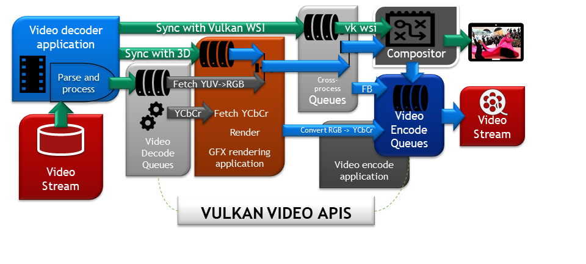

# VK_VULKAN_VIDEO

This project is a Vulkan Video Sample Application demonstrating an end-to-end, all-Vulkan, processing of h.264/5 compressed video content. The application decodes the  h.264/5 compressed content using an HW accelerated decoder, the decoded YCbCr frames are processed with Vulkan Graphics and then presented via the Vulkan WSI.

Currently, the sample application supports Linux and Windows10 operating systems.

Features
========

- [x] Extracts (DEMUX via FFMPEG) compressed video from .mp4, .mkv .mov and others video containers using h.264 (AVC) or h.265 (HEVC) compression formats. 
- [x] The HW video decoder processes textures to Vulkan Video Images that can be directly sampled from Vulkan Samplers (Textures). 
- [x] Converts the YCbCr (YUV) Images to RGB while sampling the decoded images using the [VK_KHR_sampler_ycbcr_conversion](https://www.khronos.org/registry/vulkan/specs/1.2-extensions/man/html/VK_KHR_sampler_ycbcr_conversion.html)
- [x] Displays the post-processed video frames using Vulkan WSI.
- [x] Provides the h.264/5 SPS/PPS video picture parameters inlined with each frame's parameters. This isn't compliant with the Vulkan Video Specification. Proper handling of such parameters must be done using an object of type VkVideoSessionParametersKHR.    
- [ ] Add support for VkVideoSessionParametersKHR for full compliance with the Vulkan Video Specification.
- [ ] Use Video timing synchronization (such as VK_EXT_present_timing) at the WSI side - currently the video is played at the maximum frame rate that the display device can support. The video may be played at a faster rate than it is authored.
- [ ] Convert the sample's framework to be compatible with the rest of the nvpro-samples.   

For instructions on how to build the sample decode application, please see [the build instructions.](https://github.com/nvpro-samples/vk_video_samples/blob/main/vk_video_decoder/BUILD.md)
 
